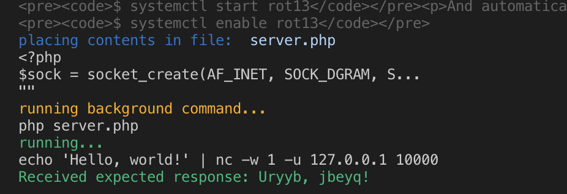

# docable

_CI for documentation_: Testing if documentation is runable.

Suppose you wanted to test the following tutorial (inspired from [benmoral](https://medium.com/@benmorel/creating-a-linux-service-with-systemd-611b5c8b91d6).)

## Example Tutorial

Let’s create a small server using PHP. I can see your eyebrows rising, but it works surprisingly well. We’ll listen to UDP port 10000, and return any message received with a ROT13 transformation:

```php
<?php
$sock = socket_create(AF_INET, SOCK_DGRAM, SOL_UDP);
socket_bind($sock, '0.0.0.0', 10000);
for (;;) {
    socket_recvfrom($sock, $message, 1024, 0, $ip, $port);
    $reply = str_rot13($message);
    socket_sendto($sock, $reply, strlen($reply), 0, $ip, $port);
}
```

Let’s start it:

```
$ php server.php
```

And test it in another terminal:

```
client$ echo 'Hello, world!' | nc -w 1 -u 127.0.0.1 10000
Uryyb, jbeyq!
```

Cool, it works. Now we want this script to run at all times, be restarted in case of a failure (unexpected exit), and even survive server restarts. That’s where systemd comes into play.

...

----

How would we test these instructions actually work? On different platforms and versions of tools? That's what `docable` helps do for you.

## Testing with `docable`

To test this example tutorial, we can run the following:

```bash
docable test examples/unix-service/steps.yml
```

`docable` uses a stepfile, such as the following.

```yml
setup:
#  local: {}  
  slim:
    image: ubuntu16.04-php

unix-service.md: 
  steps:
    - selectAsFile: ROT13 transformation => server.php
    - selectAndServe: "start it:"
    - selectAndExpect: "another terminal:"
```

The stepfile using a "select-assert" pattern for testing documentation. That is, we first find an instruction step in the tutorial using a lightweight selector, then, we transform the step into an action we can perform within a "headless infrastructure" (such as a vm), and finally we assert it's behavior is correct.

The result looks something like this:

